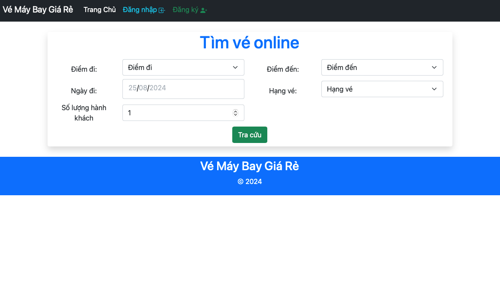
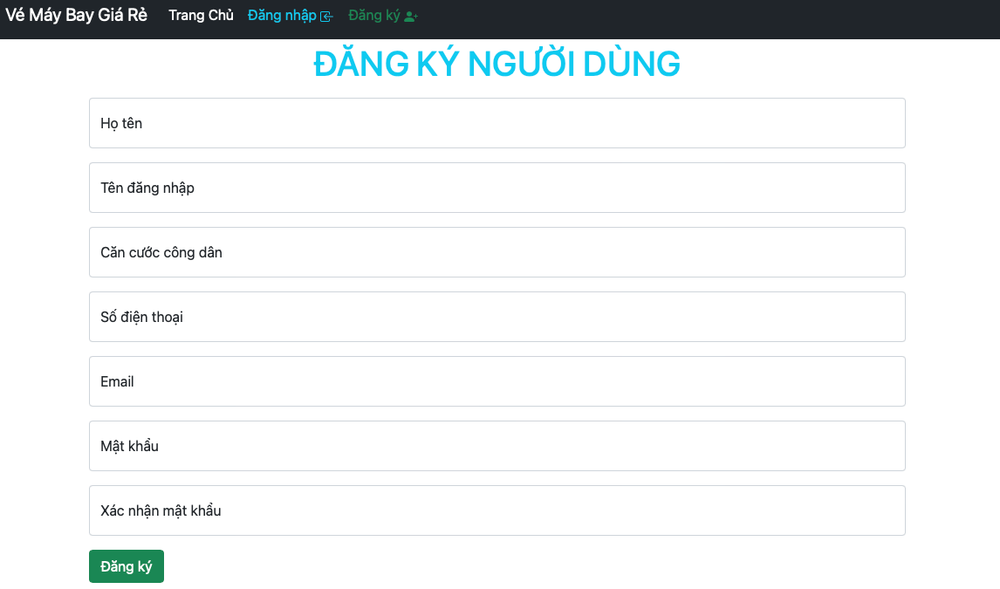
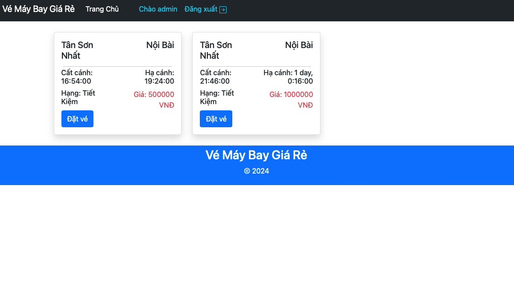
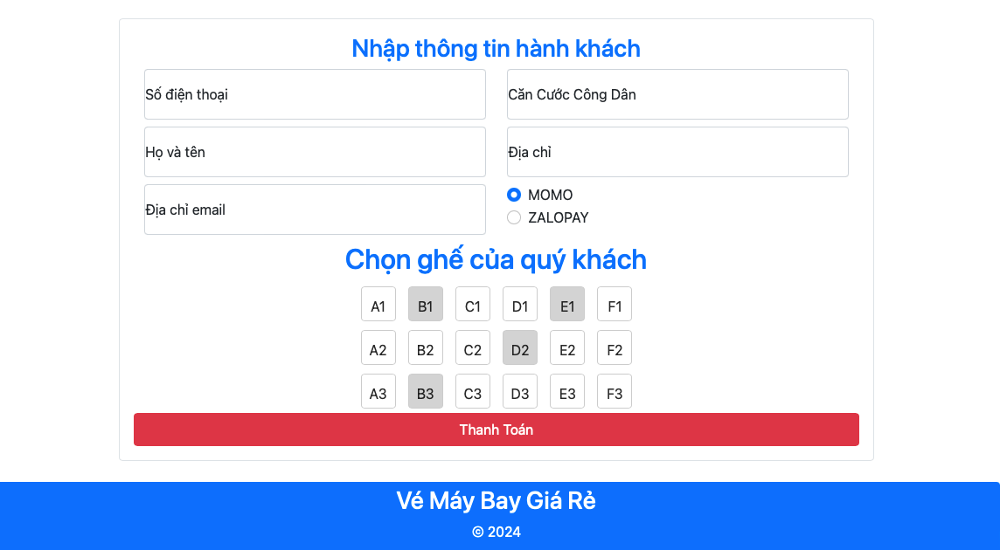
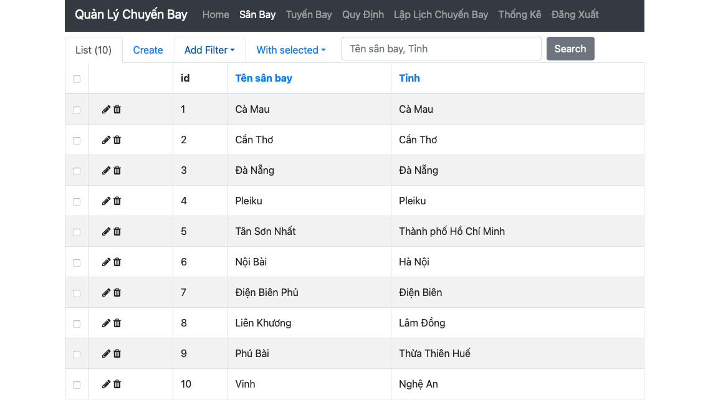
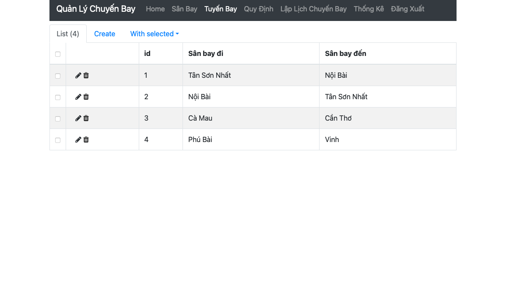
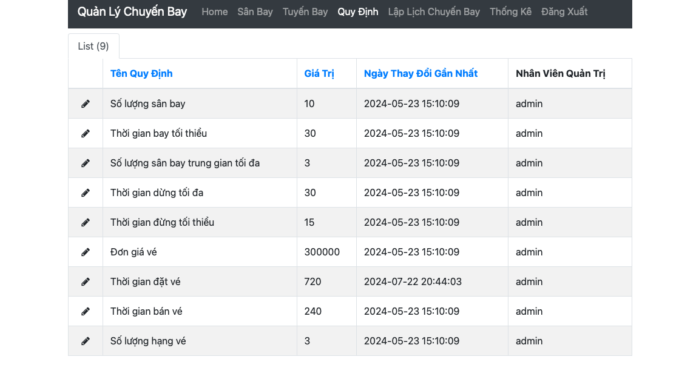
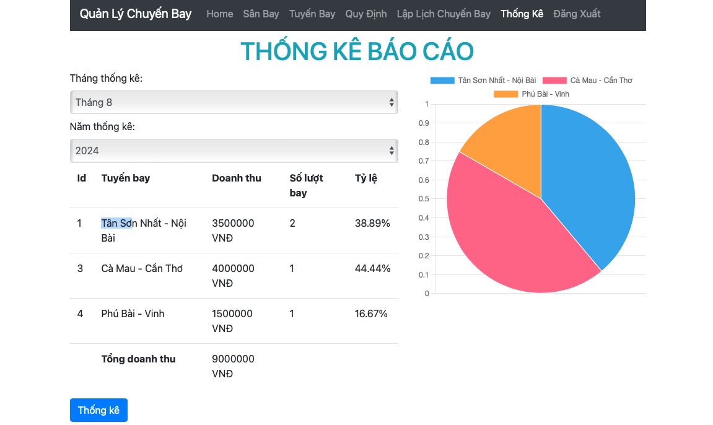

<h1>Quản Lý Chuyến Bay<h1>

<p align="center">
     <a href="https://flask.palletsprojects.com/en/3.0.x/">
        
    </a>
    <a href="https://www.mysql.com/">
        
    </a>
    <a href="https://gunicorn.org/">
        
    </a>
    <a href="https://nginx.org/en/">
        
    </a>
    <a href="https://www.docker.com/">
        
    </a>

# Tổng quan
Viết báo cáo và phát triển hệ thống quản lý chuyến bay. Báo cáo bao gồm các nội dung
- Lược đồ và đặc tả use case
- Sơ đồ sequence diagram
- Sơ đồ activity diagram
- Sơ đồ lớp -> lược đồ CSDL quan hệ
- Thiết kế giao diện

Truy cập [TẠI ĐÂY](/BaoCaoDeTai5-Nhom6-CNPM.docx) để xem đầy đủ nội dung báo cáo

# Nội dung

- [Chức năng](#chức-năng)
- [Kiến trúc hệ thống](#kiến-trúc-hệ-thống)
- [Cơ sở dữ liệu](#cơ-sở-dữ-liệu)
- [Hướng dẫn cài đặt](#hướng-dẫn-cài-đặt)
- [Giao diện](#giao-diện)
- [Tài liệu](#tài-liệu)

# Chức năng
1. <b>Tra cứu chuyến bay</b>
    - Khách hàng có thể tra cứu theo điểm đi, điểm đến, ngày đi, hạng vé và số lượng vé
2. <b>Đặt vé</b>
    - Khách hàng có thể đặt vé online (bắt buộc thanh toán trực tuyến)

    - Chỉ có thể đặt những vé còn chỗ và cho các chuyến bay trước 12h lúc khởi hàng


3. <b>Lập lịch chuyến bay</b>
    - Cho phép nhân viên lập lịch chuyến bay


4. <b>Thống kê báo cáo</b>
    - Quản trị viên xem thống kê dạng bảng và biểu đồ (sử dụng chartjs)

    - Thống kê doanh thu theo từng tháng và từng tuyến bay


5. <b>Thay đổi quy định</b>
    - Quản trị viên được thay đổi quy định
        * hay đổi số lượng sân bay, thời gian bay tối thiểu, số sân bay trung gian tối đa, thới gian dừng tối thiểu và tối đa tại các sân bay trung gian

        * Thay đối số lượng hạng vé, bảng đơn giá vé

        * Thay đổi thời gian bán vé và đặt vé

    - Quản tri viên quản lý tuyến bay, chuyến bay(thêm/xóa/cập nhật/tìm kiếm)

# Kiến trúc hệ thống


# Cơ sở dữ liệu


# Hướng dẫn cài đặt
### Yêu cầu
1. [Docker](https://www.docker.com/)

2. 
````bash
# Clone the project
git clone https://github.com/locnguyn/TrainingPointsManagement_SpringMVC_ReactJS
````

### Cài đặt

````bash
cd Flask_Flight_Management

# Build docker 
docker compose build

# Chạy docker
docker compose up -d

# Tắt docker
docker compose down
````

Truy cập `localhost:8200` để sử dụng giao diện người dùng và `localhost:5020` để sử dụng trang admin `username:admin, password:123456`

# Giao diện
### Người dùng
</img>
</img>

</img>
</img>
### Quản trị viên
</img>
</img>

</img>
</img>

# Tài liệu
* 🔗 [FLask](https://flask.palletsprojects.com/en/3.0.x/)

* 🔗 [Gunicorn](https://gunicorn.org/)

* 🔗 [Nginx](https://nginx.org/en/)

* 🔗 [MySQL](https://www.mysql.com/)


* 🔗 [Docker](https://www.docker.com/)